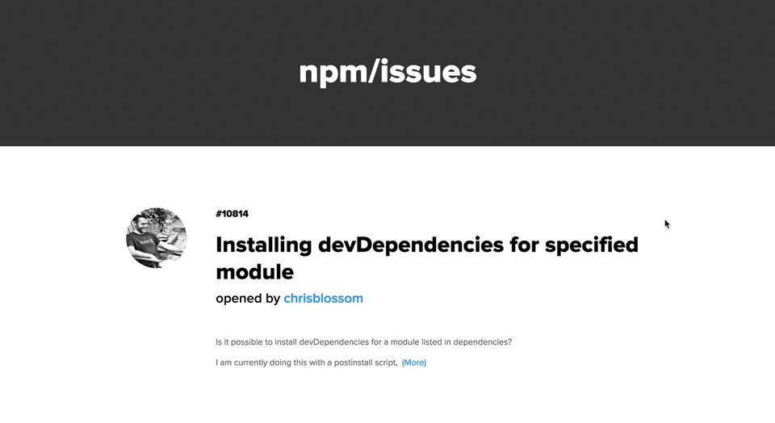
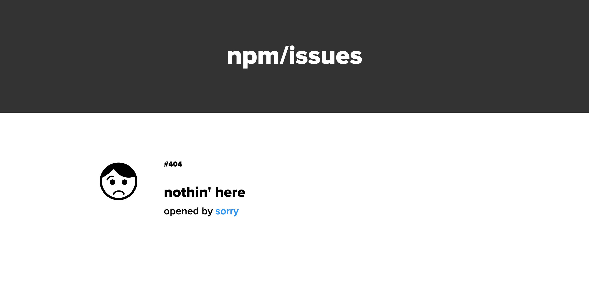

# npm/npm Github Issues Feed



## Usage
Just enter the following into the command line, and then travel to http://localhost:8080.

```
npm install 

npm start 
```

## Features
Browse through all of the issues from the npm/npm repo. 

The home feed displays 25 issues at a time and allows for navigation between pages. Each entry on the home feed displays the issue's number, title, author, author's avatar, labels, and a short (maximum 140-character) summary. 

Open up an issue to view its current state, the full summary, and any comments. Access the original issue on github.com by clicking on the title.

On any page, visit authors' Github profiles by clicking on their username or an @mention.

If you run into a page that doesn't exist, we'll let you know.



## Notes About the Implementation
The npm/npm Github Issues Feed was built using React, React Router, Webpack, and Karma and Mocha for testing. The issues were pulled from the Github Issues API, and small searches were done with the Github Search API.

Given the scope of the app, data flow is easily managed with state and props in React. 

Pagination was created manually, as the Github Issues endpoint doesn't handle entries per page. The Search API does; however, enabling it as a replacement would go against its recommended usage.

Using React Router, URLs were written to provide the best user experience.

Accessibility was considered through the use of:
 - Semantic HTML
 - Alt tags on images
 - Descriptive link text
 - Links that can be tabbed through
 - High-contrast colors for easy viewing

## Development
This app uses Webpack. Enter this command for live bundling:

```
npm run watch
```
and start up a Webpack server with:

```
npm run dev
```

## Testing
Unit tests have been implemented with Karma and Mocha. Run tests with:

```
npm test
```

Feature roadmap can be found [here](https://github.com/ljknight/issues-feed/issues).
